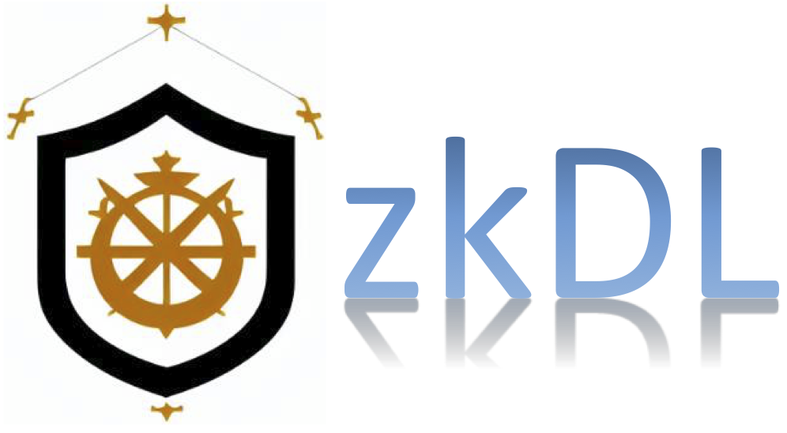
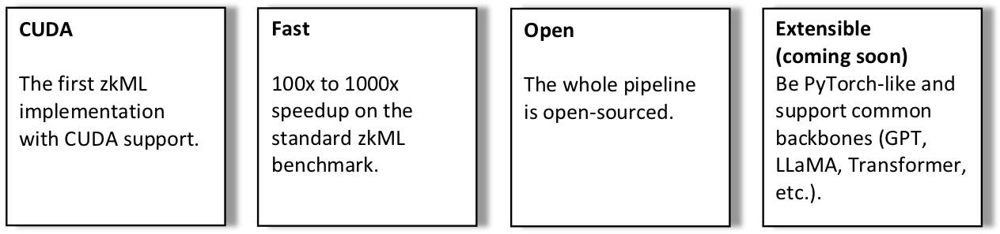
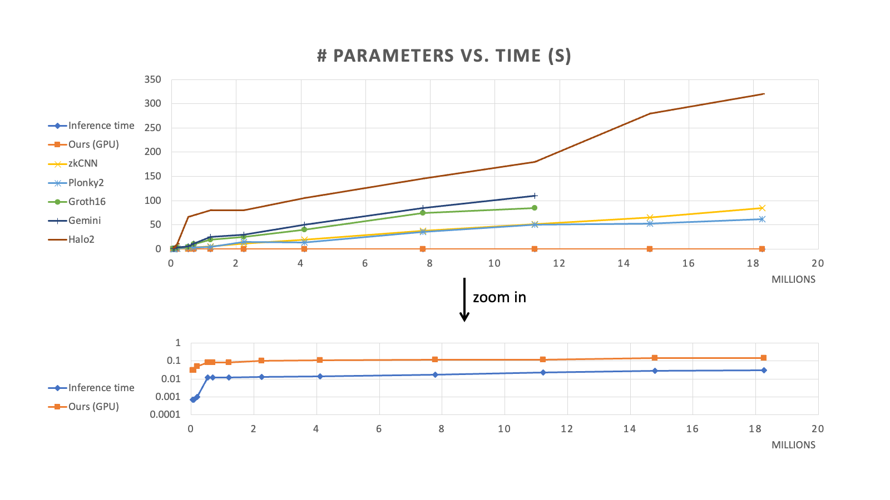

# zkDL: Zero-knowledge proof of deep learning on CUDA
 [](https://opensource.org/licenses/BSD-2-Clause) [](https://github.com/SafeAILab/zkdl/issues) [](https://github.com/SafeAILab/zkdl/pulls)

**zkDL** is a specialized backend that provides zero-knowledge proofs (ZKP) for deep learning, supported on CUDA.



## Latest News
- [ ] [2023/10/1] v1.0.0 is released.

---

## Introduction

**zkDL** represents a significant step in integrating zero-knowledge proofs with deep learning. It uniquely emphasizes the preservation of tensor structures and harnesses the parallel processing power of CUDA, resulting in efficient proof computations.

## Benchmarking

We assessed zkDL using the benchmark set by [ModulusLab](https://drive.google.com/file/d/1tylpowpaqcOhKQtYolPlqvx6R2Gv4IzE/view), which focuses on verifiable inference across fully connected neural networks of diverse scales (with up to 18M parameters). Results running on a single NVIDIA Tesla A100 GPU indicated that zkDL is capable of accelerating proving time by magnitudes of 100x to 1000x.

<div align="center">
	
</div>

## Technical Overview

- **Foundation**: This project is based on the CUDA implementation of the `bls12-381` elliptic curve, using the `ec-gpu` package developed by Filecoin.
  
- **Quantization**: For the efficient application of ZKP tools, the floating-point numbers involved in deep learning computations are quantized.
    
- **Tensor Structures and GKR Protocol**: We utilize a specialized version of the GKR protocol to maintain tensor structures, facilitating the parallelization of proofs. For operations like ReLU, which are inherently non-arithmetic and thus challenging for ZKP schemes, *auxiliary inputs* are employed to transition them into arithmetic operations.

- **Neural Network Modelling**: We fit the neural network into the ZKP backend by modelling it as an arithmetic circuit. Our strategy breaks free from the conventional layer-wise precedence, especially when non-arithmetic operations come into play, allowing for a more efficient 'flattened' circuit representation.

## Prerequisites

Before running the demo, ensure you have the following requirements:

1. **CUDA**: Ensure you identify and use a compatible CUDA architecture. In this guide, we use the `sm_70` architecture as a reference. Please refer to the [NVIDIA documentation](https://developer.nvidia.com/cuda-gpus) to choose the appropriate architecture for your GPU.

2. **Python 3.10**: We recommend managing your Python environments using `virtualenv`. Download and install Python 3.10 from the [official Python website](https://www.python.org/downloads/).

3. **PyTorch**: This can be installed within your virtual environment. Instructions are provided in the subsequent sections.

## Setup & Installation

1. **Configure the GPU Architecture**:
    - Set the desired GPU architecture in the `Makefile` by updating the `NVCC_FLAGS`:
    ```cmake
    # NVCC compiler flags
    NVCC_FLAGS := -arch=sm_70
    ```

2. **Set Up a Virtual Environment**:
    - Create and activate the environment using the following command:
    ```bash
    virtualenv --no-download --clear path/to/your/env
    source path/to/your/env/bin/activate
    ```

3. **Install Necessary Packages**:
    - Install `numpy` and `torch`. Note that installing `torch` will also include `LibTorch`, the `C++` interface for `torch`, in your virtual environment:
    ```bash
    pip install torch numpy
    ```

4. **Prepare the Model and Data**:
    - To generate example data and a model (`traced_model.pt` and `sample_input.pt`), execute:
    ```bash
    python model.py
    ```
    - Alternatively, you can use your own model and data. Ensure that they are [serialized](https://pytorch.org/docs/stable/notes/serialization.html) to be compatible with the `C++` loader. For this demo, we only support multilayer perceptrons (MLPs) with ReLU activations. The expected input tensor shape is `(batch_size, input_dim)`.

5. **Compile the Demonstration**:
    - Run the following command:
    ```bash
    make demo
    ```
    - Please be patient as the compilation might take a while, possibly a few minutes. We're aware of this and are working to enhance the compilation speed.

## Running the Demo

To start the demo, use the following command:

```bash
./demo traced_model.pt sample_input.pt
```

If you've generated `traced_model.pt` and `sample_input.pt` using our provided `model.py`:

- This command will execute an inference on a fully-connected neural network with ReLU activations, characterized by:
  - **Layers**: 8 
  - **Parameters**: ~18M
  - **Input Dimension**: 784
  - **Output Dimension**: 1000
  - **Hidden Dimensions**: Predominantly 1773, except for the first (1000) and the last (1124)
  - **Batch Size**: 256

This neural network matches the specifications of the [largest benchmark](#benchmarking).

- **Performance Expectations**:
  - The entire process, including initialization, should complete within a few seconds.
  - Proving time on a modern GPU is anticipated to be between 0.075 to 0.15 seconds. Actual timings may vary based on server performance.

For convenience, we've encapsulated the build and demo run processes in `demo.sh`. Execute it using:

```bash
sbatch demo.sh # Tested on our slurm-managed cluster
```
or simply:

```bash
./demo.sh
```

## Future Development

- [ ] Broaden the range of supported structures and back propagations to increase adaptability.

- [ ] Re-introduce zero-knowledge verifiable **training** alongside **inference**, as detailed in [zkDL: Efficient Zero-Knowledge Proofs of Deep Learning Training](https://arxiv.org/abs/2307.16273).

- [ ] Implement proof compression across deep learning layers and explore a multi-GPU version for enhanced performance.

## License
The license for this zkML tool is BSD-2-Clause.

## Contribution
As an open-source project in a dynamically evolving field, we wholeheartedly welcome contributions, whether they take the shape of novel features, enhanced infrastructure, or improved documentation.

For those interested in contributing to zkDL or seeking further information, please submit a pull request or reach out to Haochen Sun at haochen.sun@uwaterloo.ca. If you find this repository useful, please consider giving ⭐.

