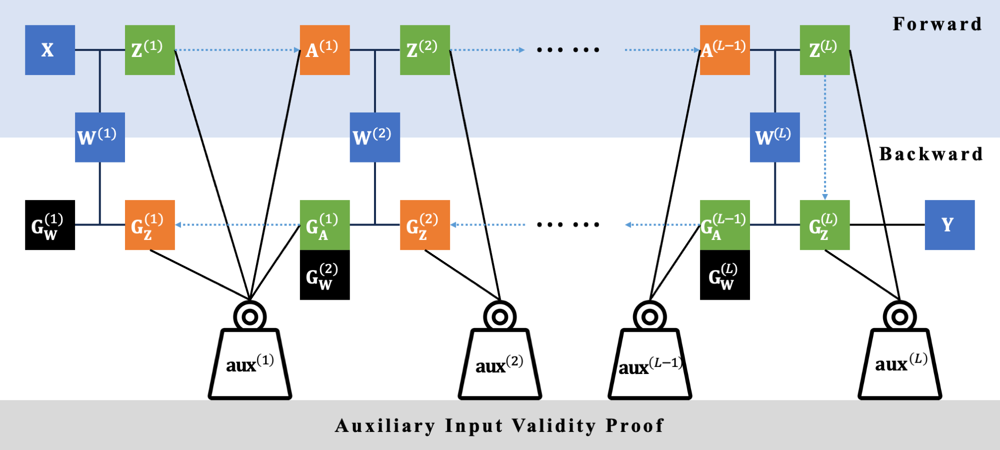

# zkDL: Zero-knowledge proof of deep learning on CUDA
[](https://opensource.org/licenses/BSD-2-Clause)

**zkDL** is a specialized backend that combines zero-knowledge proofs (ZKP) with deep learning, specifically optimized for CUDA.


## Latest News
- [ ] [2023/10/1] v1.0 is released.

---

## Introduction

**zkDL** represents a significant step in integrating zero-knowledge proofs with deep learning. It uniquely emphasizes the preservation of tensor structures and harnesses the parallel processing power of CUDA, resulting in efficient proof computations.

## Benchmarking

We assessed zkDL using the benchmark set by [ModulusLab](https://medium.com/@ModulusLabs/chapter-5-the-cost-of-intelligence-da26dbf93307), which focuses on verifiable inference across fully connected neural networks of diverse scales (with up to 18M parameters). Results running on a single A100 GPU indicated that zkDL is capable of accelerating proof time by magnitudes of 100x to 1000x.


## Technical Overview

- **Foundation**: This project is based on the CUDA implementation of the `bls12-381` elliptic curve, using the `ec-gpu` package developed by Filecoin.
  
- **Quantization**: For the efficient application of ZKP tools, the floating-point numbers involved in deep learning computations are quantized.
    
- **Tensor Structures and GKR Protocol**: We utilize a specialized version of the GKR protocol to maintain tensor structures, facilitating the parallelization of proofs. For operations like ReLU, which are inherently non-arithmetic and thus challenging for ZKP schemes, *auxiliary inputs* are employed to transition them into arithmetic operations.

- **Neural Network Modelling**: We fit the neural network into the ZKP backend by modelling it as an arithmetic circuit. Our strategy breaks free from the conventional layer-wise precedence, especially when non-arithmetic operations come into play, allowing for a more efficient 'flattened' circuit representation.



## Prerequisites

Ensure CUDA is installed on your system, and identify the compatible CUDA architecture. For this documentation, we use the `sm_70` architecture as an example, commonly found in Nvidia Tesla V100.

## Setup & Installation

1. Set the architecture using NVCC_FLAGS in the `Makefile`:

```cmake
# NVCC compiler flags
NVCC_FLAGS := -arch=sm_70
```

2. Compile the demonstration:

```bash
make demo
```

Note that it is typical for the compilation to take some time, possibly up to a few minutes. We are actively working on streamlining this process.

## Running the Demo

To initiate the demo:

```bash
# ./demo batch_size input_dim hidden_dim hiddem_dim ... hidden_dim output_dim
./demo 64 784 1000 1773 1773 1773 1773 1773 1124 1000
```
This command will run an inference on a fully connected ReLU neural network with 8 layers and ~18M parameters, with input dimension 784, output dimension 1000, and hidden dimensions 1773 (with the exception of 1000 for the first, and 1124 for the last), and a batch size of 64. This neural network aligns with the size of the [largest benchmark](#benchmarking). The entire process, including initialization, should conclude in a few seconds.

## Future Development

- [ ] Broaden the range of supported structures and back propagations to increase adaptability.

- [ ] Re-introduce zero-knowledge verifiable **training** alongside **inference**, as detailed in [zkDL: Efficient Zero-Knowledge Proofs of Deep Learning Training](https://arxiv.org/abs/2307.16273).

- [ ] Implement proof compression across deep learning layers and explore a multi-GPU version for enhanced performance.

## License
The license for this zero-knowledge tool is BSD-2-Clause.

## Contribution
As an open-source project in a dynamically evolving field, we wholeheartedly welcome contributions, whether they take the shape of novel features, enhanced infrastructure, or improved documentation.

For those interested in contributing to zkDL or seeking further information, please reach out to Haochen Sun at haochen.sun@uwaterloo.ca.

